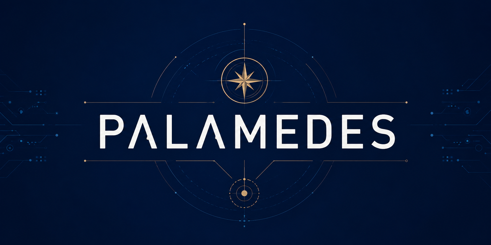

# Palamedes

<p align="center">
  
</p>

Palamedes is an experimental inquiry and plan-state kernel for work whose
direction changes as people, models, references, implementation, and reality
interact.

It treats a plan as revisionable state rather than disposable text. Alongside
goals, evidence, hypotheses, and restore points, Palamedes can preserve
`view_transitions`: what was previously believed, what changed the view, what
became visible, what the new frame may hide, and which probe should follow.
It also distinguishes inquiry from commitment, reference collection from
reference influence, and ordinary tasks from development steps intended to
produce new information.

Palamedes does not claim to manufacture originality or guarantee startup
success. It provides an auditable surface for exploring those questions without
silently rewriting the path taken. The current inquiry, including counterpoints
and unresolved tensions, is preserved in
[`PALAMEDES_INQUIRY.md`](PALAMEDES_INQUIRY.md).

## Current Status

Palamedes is ready for alpha release and early adopter use.

- `core` contract surfaces such as persisted plan state, fingerprint conflict semantics, restore behavior, and documented HTTP envelopes are treated as stable according to `STABILITY.md`
- `reference` surfaces such as host orchestration contracts, reference adapters, and example integrations are still experimental
- `inquiry` surfaces such as view-transition lineage and longitudinal evaluation are active product hypotheses, not settled doctrine
- the repository currently ships a canonical Python reference surface plus a thin TypeScript HTTP consumer

Use it when:

- you have ideas but do not know what to validate first
- AI is helping you build fast, but direction keeps drifting
- you need a clear reason to choose one path and kill others
- you want evidence, failure criteria, and replanning history in one place

It keeps planning state in your repo with:

- one current plan
- explicit evidence and hypotheses
- traceable changes of view
- revision history
- restore points
- a defined moment to replan

It is intentionally `plan-only`. Palamedes does not run tasks, schedule workflows, or own delivery.

## Architecture

Palamedes is organized around one planning kernel with a few integration surfaces around it.

```text
palamedes/
├── palamedes.py                    # Core planning kernel and CLI
├── palamedes_server.py             # Local HTTP transport
├── palamedes_sdk/                  # Packaged Python client surface
├── palamedes_reference_adapter.py  # Canonical Python reference adapter
├── palamedes_reference_host.py     # Canonical Python reference host
├── palamedes_reference_consumer.ts # Thin TypeScript HTTP consumer
├── spec/                          # Public contract entrypoints
└── tests/contracts/               # Fixture-backed conformance cases
```

Separation of concerns:

| Layer | Responsibility |
| --- | --- |
| `core` | Persisted plan state, evidence, hypothesis log, revision history, QA, conflict and restore semantics |
| `transport` | CLI, HTTP, and agent wrapper access to the same planning kernel |
| `reference` | Python host/adapter and TypeScript consumer for real integration examples |
| `conformance` | Contract fixtures and runners that verify stable adopter-facing behavior |

The important design choice is that the plan is the source of truth. Everything else exists to read it, mutate it safely, or verify that another implementation behaves the same way.

## Planning Flow

Palamedes is easiest to understand as one stateful loop:

```text
choose direction
    ↓
write plan state
    ↓
add evidence, hypotheses, and view transitions
    ↓
review plan quality
    ↓
replan or restore when the evidence changes
```

In transport terms, the same loop looks like this:

```text
client/tool writes plan
    ↓
fingerprint guard checks stale writes
    ↓
plan revision is recorded
    ↓
QA and health surfaces stay inspectable
    ↓
history / restore / conformance stay available to other consumers
```

## Why Use It

Palamedes is for the layer before execution:

- what to build
- why now
- what evidence supports it
- what would invalidate it
- when to replan

In the AI era, execution is getting cheaper while direction is not.

More systems can generate code, content, tasks, and workflows.
That does not solve the harder problem:

- choosing the right direction
- rejecting weak directions early
- finding better evidence before execution hardens the wrong path
- keeping product and business intent coherent over time

Palamedes exists to reduce that failure mode.

## Product Boundary

Palamedes is `plan-only` by design.

Palamedes should own:

- idea discovery
- direction setting
- planning logic
- success and failure criteria
- evidence-backed replanning
- revision-aware recovery

Palamedes should not own:

- task execution orchestration
- delivery automation
- general agent runtime concerns
- workflow scheduling
- channel or chat surfaces

Those layers can be built around Palamedes, but they should not blur the purpose of this repo.

## What Makes It Different

Palamedes is not:

- a note-taking app
- a generic project manager
- a workflow orchestrator
- an execution agent runtime
- a loose PRD template

Palamedes is:

- a structured decision state in your repo
- an evidence-backed planning loop
- a versioned history of why the plan changed
- a safe replan and restore system for direction changes

The core unit is the current `plan`.
Everything else exists to improve plan quality over time:

- `evidence` tests whether the plan is grounded
- `hypothesis_log` tracks bets and outcomes
- `view_transitions` preserves why the current frame changed, what the new
  frame may hide, and which probe should follow
- `revisions` show how the plan changed
- `restore` lets you safely recover a better prior direction

## Access Surfaces

Palamedes currently ships four access surfaces around the same planning core:

| Surface | Purpose |
| --- | --- |
| CLI | Local-first planning workflows in the repo |
| HTTP service | Local integration for editors, sidecars, and non-Python consumers |
| Agent wrapper | Slash-command and natural-language planning control |
| Python client | Typed integration with conflict/retry handling |

The core guarantees across these surfaces are:

- a consistent plan schema
- explicit contract and implementation versions
- revision history and safe restore preview
- stale-write protection with fingerprints
- storage health and recovery diagnostics
- fixture-backed conformance checks for stable public behavior

## Example Outcome

You start with three possible directions:

- AI planning tool for founders
- agent workflow layer for developers
- local research memory for solo builders

After one Palamedes loop, the output should be sharper:

- chosen direction: AI planning tool for founders
- rejected directions: workflow layer is crowded, research memory is less urgent
- success metric: 5 founder users complete one weekly planning review
- failure signal: users keep asking for task execution instead of planning help
- next evidence to collect: 10 founder interviews, 3 weekly usage check-ins
- replan point: revisit direction after 14 days or after 5 interviews contradict the core pain

That is the job: force a better direction decision before more building happens.

## Who It Is For

Palamedes is strongest for:

- solo builders working with AI
- early-stage founders
- developers in 0->1 exploration
- small teams running many direction changes and experiments

It is a weaker fit for:

- teams that mainly need task tracking
- execution-heavy automation pipelines
- organizations already centered on a rigid PM stack

## Core Concepts

Palamedes centers on one mutable plan plus supporting logs.

- `plan`: the current structured planning state
- `evidence`: concrete signals tied to planning axes
- `hypothesis_log`: testable bets and outcomes
- `reference_discoveries`: logged reference-search questions, criteria, and shortlisted candidates
- `view_transitions`: traceable changes from a previous view to a new view
- `inquiry_items`: statements classified by intent and commitment
- `reference_encounters`: why a reference mattered and what effect it had
- `development_probes`: build steps defined by what they should reveal
- `open_questions`: unresolved questions with multiple views and blind spots
- `risks`: failure modes, early signals, mitigation
- `revisions`: immutable plan snapshots over time
- `events`: operational history such as auto-replan activity

Long-horizon planning is first-class:

- `planning_horizon`
- `review_cadence`
- `phase_plan`

Insight coverage is organized across eight axes:

1. `direction_insights`
2. `market_insights`
3. `timing_insights`
4. `differentiation_insights`
5. `monetization_insights`
6. `constraint_insights`
7. `risk_signal_insights`
8. `evolution_insights`

## State Model

Palamedes stores repo-local state in `.palamedes/`:

- `plan.json`: current plan
- `decisions.jsonl`: decision log
- `risks.jsonl`: risk log
- `events.jsonl`: operational events
- `revisions.jsonl`: plan revision history

The runtime also tracks:

- `schema_version`: canonical contract version for persisted plan state
- `version`: compatibility alias for older consumers of the same contract version
- `fingerprint`: stale-write protection token for the current plan
- revision history for restore and audit
- storage health, recovery candidates, and retention windows

## Contract Surface

Palamedes now separates implementation release cadence from the persisted planning contract.

- `plan.schema_version` is the canonical contract version for persisted state
- `plan.version` is kept as a compatibility alias during the transition
- contract policy lives in `STABILITY.md` and `CONTRACT_VERSIONING.md`
- normative contract docs live in `spec/`
- fixture-backed contract tests live in `tests/contracts/`
- aggregated contract/readiness surfaces are available at `GET /contracts` and `GET /doctor`
- the conformance runner is available through `python3 palamedes.py conformance`

Current stability boundary:

| Surface | Status |
| --- | --- |
| persisted plan state | stable |
| fingerprint conflict and restore semantics | stable |
| documented HTTP envelopes | stable |
| fixture-backed conformance cases | stable |
| host action contract | experimental |
| reference adapters and example integrations | experimental |

## Quick Start

The first 5 to 10 minutes should produce:

1. one chosen direction
2. weak directions you did not choose
3. a testable plan with metric, deadline, and review cadence
4. evidence and hypotheses that can change the plan later

Start with the default loop:

1. initialize local planning state
2. generate a few directions
3. choose one plan
4. add one evidence item
5. review whether to continue or replan

```bash
python3 palamedes.py init
python3 palamedes.py ideate --profile "solo builder" --interests "automation,founder tools" --count 3
python3 palamedes.py plan \
  --goal "Validate an AI planning tool for founders" \
  --success-metric "5 founder users complete one weekly planning review by 2026-04-30" \
  --deadline "2026-04-30" \
  --planning-horizon "4 weeks" \
  --review-cadence "weekly" \
  --phase-plan "phase1 interviews,phase2 weekly review test,phase3 tighten positioning" \
  --constraints "single developer, local repo only" \
  --direction-insights "Founders have execution help but weak planning support" \
  --market-insights "Founder-led teams feel repeated direction drift" \
  --timing-insights "AI lowered build cost, making direction errors more expensive" \
  --differentiation-insights "Decision state with evidence and replanning, not task execution" \
  --monetization-insights "Paid weekly planning workflow for founder teams" \
  --constraint-insights "Need a narrow user and local-first scope" \
  --risk-signal-insights "If founders mainly ask for task automation, positioning is wrong" \
  --evolution-insights "Start with founder planning, expand only after repeated validation"
python3 palamedes.py evidence --claim "3 founders said direction drift is worse than shipping speed" --source "interviews" --confidence 72 --axis market
python3 palamedes.py hypothesis --hypothesis "Founders will return weekly for plan review" --metric "weekly review completions" --target ">=5" --window "14 days" --status open
python3 palamedes.py view \
  --previous-view "A better strategist report is the primary product value" \
  --trigger "Building and model progress exposed a wider viewpoint-evolution problem" \
  --new-view "Preserve why views change across references, implementation, and outcomes" \
  --new-blind-spots "Process language can excuse drift or delay closure" \
  --opened-paths "longitudinal comparison,reference influence history" \
  --next-probe "Run one live project through repeated view-build-observe cycles" \
  --source "owner inquiry" \
  --references "PALAMEDES_INQUIRY.md"
python3 palamedes.py inquiry \
  --statement "Would a fine-tuned model help?" \
  --kind thought_experiment \
  --status closed \
  --intent "Widen the reasoning space, not propose a roadmap" \
  --commitment none
python3 palamedes.py encounter \
  --reference "/Users/ze/work/ref" \
  --encountered-while "Studying collected repository patterns" \
  --initial-interest "Collection history may expose direction" \
  --relation "Reference influence may be stronger evidence than clone presence" \
  --effect opened_question
python3 palamedes.py probe \
  --step "Run one live view-build-observe cycle" \
  --expected-learning "Whether the record exposes a meaningful view change"
python3 palamedes.py question \
  --question "How should creativity and success interact?" \
  --perspectives-json '[{"view":"creativity","reveals":["possibility"],"hides":["viability"]},{"view":"success","reveals":["reality"],"hides":["fragile novelty"]}]' \
  --revisit-when "After three live cases"
python3 palamedes.py show
python3 palamedes.py review
```

Then expand only if needed:

- `replan`: change direction from new evidence
- `discover`: structure external reference search before copying patterns
- `history`: inspect revision history
- `restore --preview`: inspect a previous revision safely
- `health`: inspect storage and recovery status

## Planning Commands

Palamedes is designed around explicit planning loops:

- `plan`: define or overwrite core direction
- `evidence`: add structured market/product signal
- `discover`: structure reference search before adopting external patterns
- `hypothesis`: track testable assumptions
- `replan`: change the plan from new evidence
- `review`: inspect plan quality and next questions
- `restore`: recover an earlier plan snapshot safely

QA is built into plan updates and can trigger auto-replan when the plan is thin but recoverable.

## Concurrency, Restore, and Retry

### Fingerprints

Every current plan state has a `fingerprint`.

- Writes can include `expected_fingerprint`
- HTTP callers use `If-Match: "<fingerprint>"`
- stale writes return `412 Precondition Failed` instead of silently overwriting the plan

### Restore

Restore is treated as a normal write:

- preview via `restore --preview` or `POST /restore/preview`
- restore via `restore` or `POST /restore`
- restore uses the same concurrency contract as other writes

### Retry Policy

The Python client has typed conflict and retry semantics:

- `PalamedesConflictError`: stale fingerprint conflict
- `PalamedesClientOperationError`: higher-level multi-step failure
- `PalamedesHealthGateError`: optional write blocked by degraded storage health
- append-style operations can carry `idempotency_key` to safely dedupe retries

Default retry policy is conservative:

- automatic refresh-and-retry is enabled for `update_plan`
- `restore_revision` is also treated as safe overwrite-style retry
- append-style operations such as `add_evidence` and `replan` require `allow_non_idempotent_retry=True`
- when opt-in retry is enabled for append-style operations, the client injects an `idempotency_key` if one is missing
- multi-step write flows can require healthy storage with `require_healthy=True`

## CLI

Main commands:

- `init`: create `.palamedes/` state files
- `plan`: create or overwrite core plan fields
- `replan`: update the plan from new evidence
- `decide`: append a decision record
- `risk`: append a risk record
- `evidence`: append structured evidence
- `discover`: generate or apply a reference-discovery pass
- `hypothesis`: append structured hypothesis entries
- `qa`: run QA checks manually
- `validate`: validate plan structure and nested records
- `schema`: inspect or rewrite `schemas/plan.schema.json`
- `health`: print storage health and recovery diagnostics
- `maintenance`: inspect or apply bounded log maintenance
- `show`: print current plan summary
- `history`: print revision history
- `restore`: preview or restore a prior revision
- `ideate`: generate option seeds from lightweight context
- `insight`: generate viewpoint-expansion insight packs
- `view`: record a traceable change of view without declaring it final
- `inquiry`: classify a statement without promoting it to a plan
- `encounter`: record a reference's actual influence
- `probe`: record a development step by its expected learning
- `question`: preserve unresolved perspectives and blind spots
- `review`: run cycle-based review with recommendations

Development checks:

```bash
make check
make test
make compile
make schema-check
```

## HTTP API

Start the local service:

```bash
python3 palamedes_server.py --host 127.0.0.1 --port 8787
```

Available endpoints:

- `GET /plan`: current plan, summary, validation, fingerprint
- `GET /qa`: QA report
- `GET /health`: storage health and recovery diagnostics
- `GET /cycle`: plan + QA + health + recent history snapshot
- `GET /history`: revision history
- `GET /validate`: structural validation
- `GET /tools`: agent tool schemas
- `POST /plan`: update plan fields
- `POST /evidence`: append one evidence item
- `POST /replan`: append plan deltas and rerun QA
- `POST /restore/preview`: preview restore target directly
- `POST /restore`: restore a revision directly
- `POST /tools/<tool_name>`: execute one tool wrapper
- `POST /agent/act`: map slash/natural-language input to a tool call

Example:

```bash
curl http://127.0.0.1:8787/cycle?limit=5
curl http://127.0.0.1:8787/plan
curl http://127.0.0.1:8787/qa
curl http://127.0.0.1:8787/health
curl http://127.0.0.1:8787/history
curl -X POST http://127.0.0.1:8787/plan \
  -H 'Content-Type: application/json' \
  -H 'If-Match: "<fingerprint-from-get-plan>"' \
  -d '{"goal":"Ship local agent layer"}'
curl -X POST http://127.0.0.1:8787/restore/preview \
  -H 'Content-Type: application/json' \
  -d '{"previous":true}'
```

## Agent Wrapper

The local wrapper exposes slash-style and lightweight natural-language control:

```bash
python3 palamedes_agent.py tools
python3 palamedes_agent.py run --input '/palamedes.show'
python3 palamedes_agent.py run --input '/palamedes.health'
python3 palamedes_agent.py run --input '/palamedes.history'
python3 palamedes_agent.py run --input '/palamedes.restore-preview revision_id=<revision-id>'
python3 palamedes_agent.py run --input 'preview previous revision'
python3 palamedes_agent.py run --input '/palamedes.plan goal="Ship local agent layer" planning_horizon="4 weeks" review_cadence=weekly'
python3 palamedes_agent.py run --input '/palamedes.replan evidence="Pilot retention improved" evidence_confidence=70 evidence_axis=market'
python3 palamedes_agent.py run --input '/palamedes.evidence claim="Repeated planning pain" source=interviews confidence=72 axis=market'
python3 palamedes_agent.py run --input 'show plan'
```

Supported slash commands:

- `/palamedes`
- `/palamedes.plan`
- `/palamedes.replan`
- `/palamedes.show`
- `/palamedes.health`
- `/palamedes.history`
- `/palamedes.restore`
- `/palamedes.restore-preview`
- `/palamedes.qa`
- `/palamedes.validate`
- `/palamedes.evidence`
- `/palamedes.hypothesis`

Tool responses use stable `ok`, `tool_name`, and `result_type` fields.

## Python Client

The repo includes a lightweight client in `palamedes_sdk/`.

```python
from palamedes_sdk import (
    PalamedesClient,
    PalamedesClientOperationError,
    PalamedesConflictError,
    PalamedesHealthGateError,
)

client = PalamedesClient.from_http("127.0.0.1", 8787)

cycle = client.get_cycle(history_limit=5)
updated = client.update_plan({"goal": "Ship local agent layer"})

wrapped = client.apply_and_get_cycle(
    "update_plan",
    {"goal": "Ship local agent layer", "success_metric": "Reach 2 pilots", "deadline": "2026-04-03"},
    history_limit=3,
)

restored = client.apply_and_get_cycle(
    "restore_revision",
    {"previous": True},
    history_limit=3,
)

retried = client.apply_and_get_cycle_with_retry(
    "update_plan",
    {"goal": "Ship local agent layer"},
    expected_fingerprint="stale-fingerprint",
)

cycle_result = client.capture_evidence_cycle(
    {"claim": "Pilot friction repeated", "source": "pilot-call", "confidence": 74, "axis": "market"},
    replan_payload={"plan_task": "Tighten onboarding loop"},
    idempotency_key="pilot-friction-cycle-1",
)
```

Use the client when another repo needs Palamedes planning state without re-implementing:

- stale-write handling
- refresh-and-retry policy
- post-write cycle snapshots
- restore preview / restore flows
- optional health-gated writes

See also:

- `STABILITY.md`
- `CONTRACT_VERSIONING.md`
- `spec/plan-state.md`
- `spec/http-api.md`
- `spec/conflict-and-restore.md`
- `docs/integration-agentscope.md`
- `docs/palamedes-agents-bootstrap.md`
- `palamedes_reference_adapter.py`
- `palamedes_reference_host.py`
- `palamedes_reference_consumer.ts`
- `examples/palamedes_kernel_adapter.py`
- `examples/palamedes_planner_host.py`
- `examples/palamedes_reference_consumer.ts`
- `examples/palamedes_agents_skills/registry.py`
- `scaffolds/palamedes_agents/`
- `palamedes_client.py` remains as a compatibility import path

Install the SDK surface locally from this repo:

```bash
python3 -m pip install -e .
```

## Design Principles

Palamedes favors:

1. Strong references
2. Actionable insights
3. Audience interest detection
4. Need intensity detection
5. High information density
6. Multiple viewpoints

Humans bring context from experience and intent.
AI should improve decision quality, not just generate more tasks.

## 📈 Star History

<a href="https://star-history.com/#LEE-Kyungjae/Palamedes&Date">
  <picture>
    <source
      media="(prefers-color-scheme: dark)"
      srcset="https://api.star-history.com/svg?repos=LEE-Kyungjae/Palamedes&type=Date&theme=dark"
    />
    <source
      media="(prefers-color-scheme: light)"
      srcset="https://api.star-history.com/svg?repos=LEE-Kyungjae/Palamedes&type=Date"
    />
    
  </picture>
</a>
